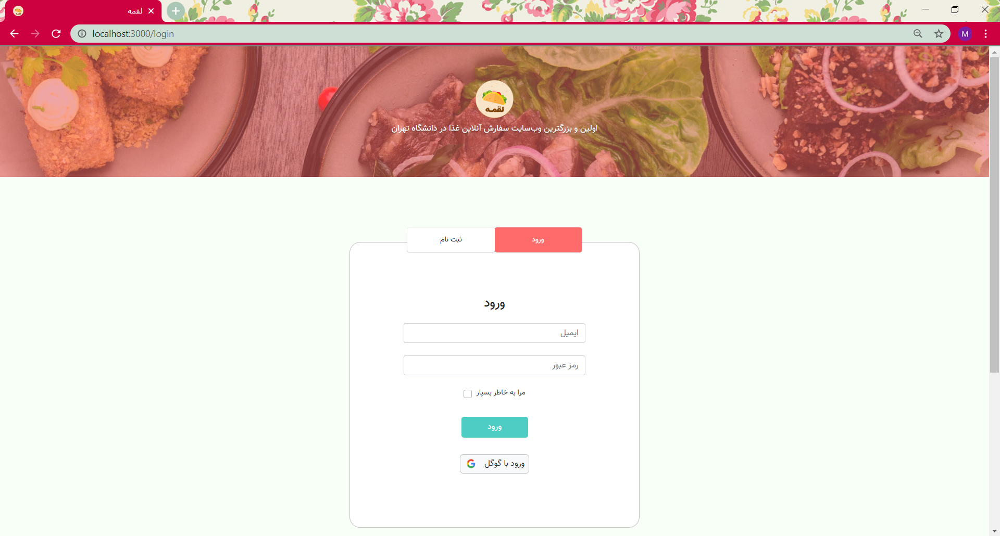
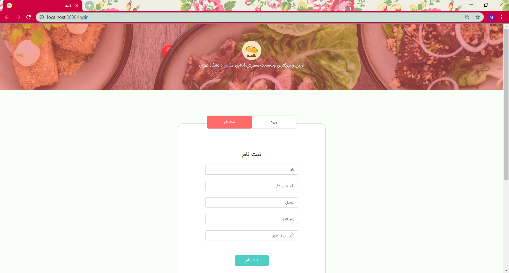
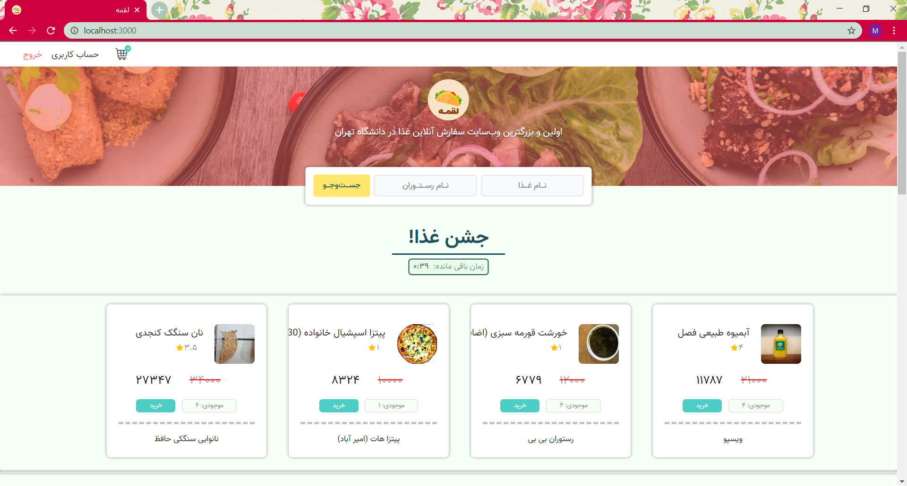
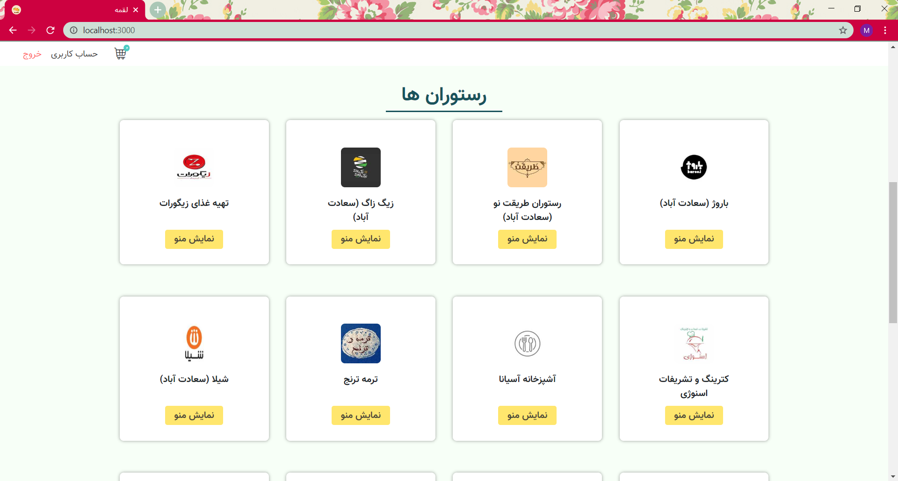
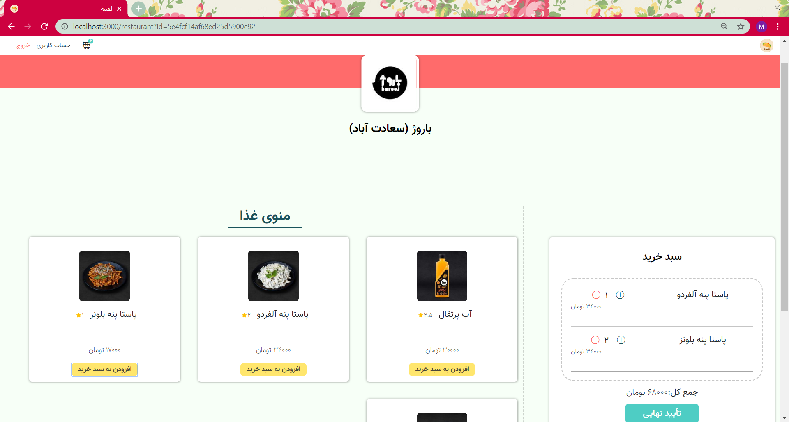
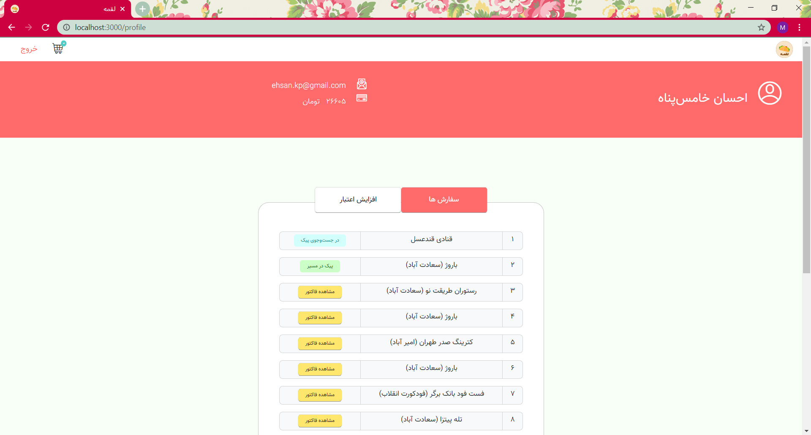
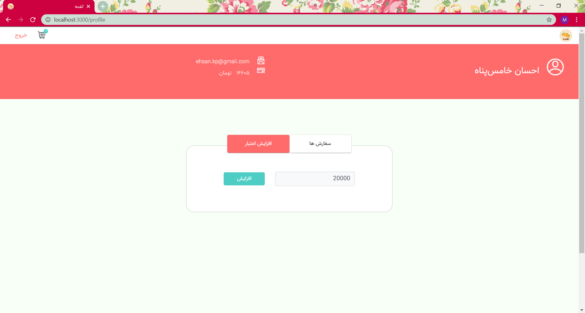
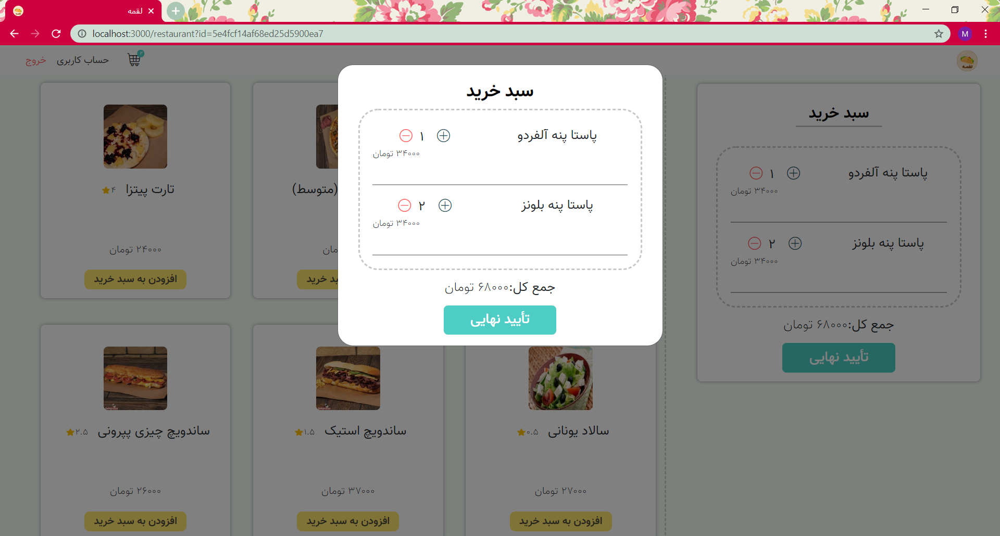
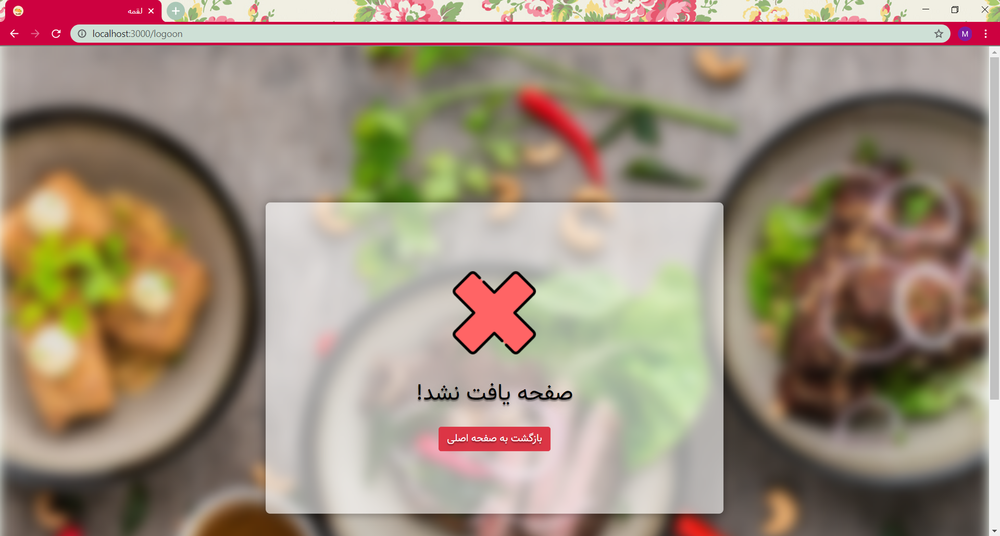

# Loghmeh

An online food ordering platform

## Screenshots

## Built With

* [Java](https://www.java.com/en/) - back-end
* [React](https://reactjs.org/) - front-end
* [MySQL](https://www.mysql.com/) - database
* [Docker](https://www.docker.com/) - containerising
* [Kubernetes](https://kubernetes.io/) - deployment

## Developers

* [**Mobina Shahbandeh**](https://gitlab.com/mobina)
* [**Omid Bodaghi**](https://gitlab.com/omigo00)

